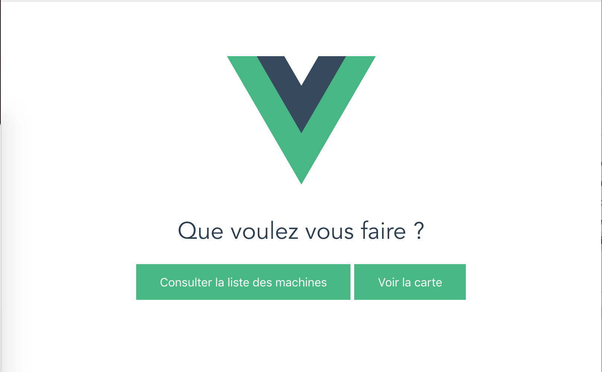
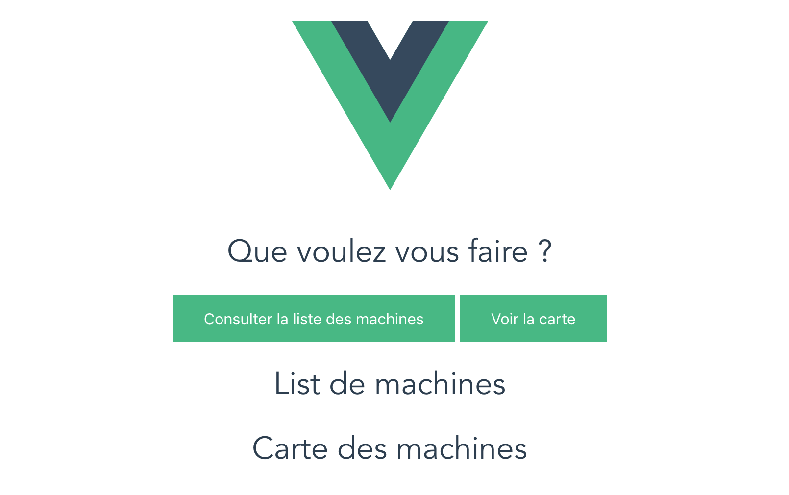
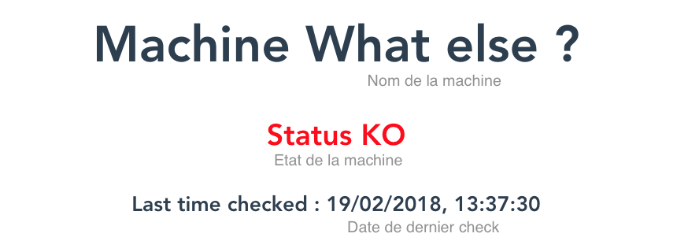
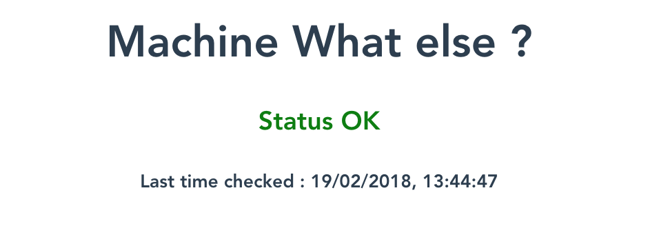
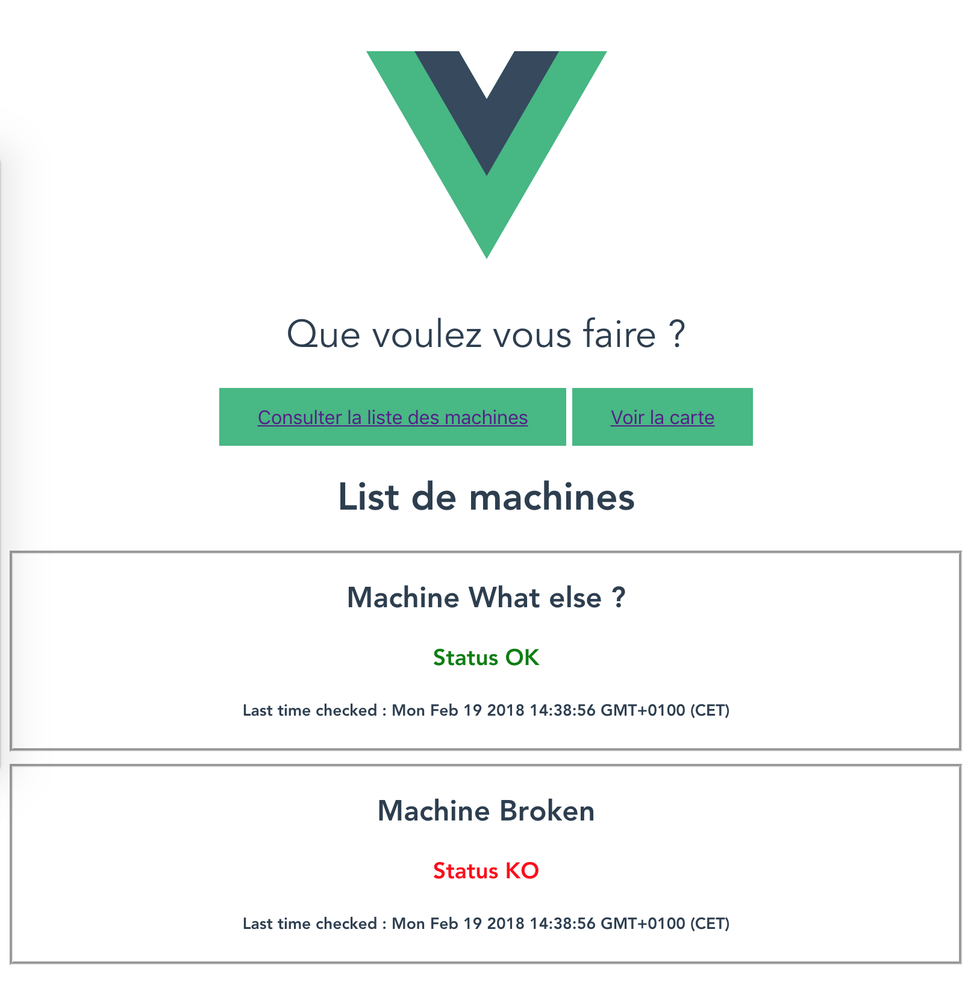
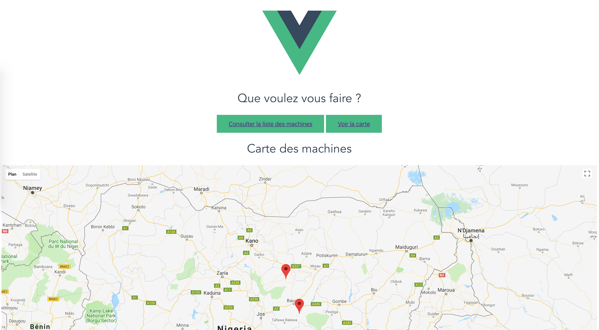

# Application de gestion du parc des machines à cafés.

### 1) Initialiser une application Vue.

* Commençons par créer une application VueJS, pour cela utilisons l'interface en ligne de commande officielle `vue-cli`.

Si ce n'est pas fait, il faut d'abord l'installer avec npm :

```
npm install --global vue-cli
```

**Question :** Rappeler ce qu'est npm et pourquoi nous utilisons l'option --global ?

  *Votre réponse : *

* Créer maintenant l'application :

```
vue create browserify-simple [NOM_PROJET]
```

Si des questions vous sont posées, choisissez les options par défaut.

* Quels sont des bons réflexes à avoir quand vous télécharger un nouveau projet ? Quels fichiers regarder ? Avant même de commencer à lancer l'application et sans regarder le code vous pouvez apprendre plein de choses.

  *Votre réponse : *

* Si vous regarder le fichier `README.md` du projet vous voyez que trois commandes sont indiquées, quel est le but de chacune ?

 *Votre réponse : *
 
* Lancer le projet.

Une fois que tout fonctionne faites un premier commit ( vous aurez surement besoin d'initialiser le repository git ). Quelle est la commande à utiliser ? 🤔

 *Votre réponse : *


### 2) Ecran d'accueil.

Dans un premier temps, nous voulons changer l'écran d'accueil, ce dernier permettra à l'agent de maintenance de choisir entre consulter la liste des machines ou afficher la carte.

Faites les modifications nécessaires, voici à titre d'exemple un rendu possible :



Ajouter dans votre composant app deux méthodes : `onMachinesListClick` et `onMapClick` qui devront faire des alertes pour marquer le fait qu'un utilisateur a cliqué dessus.


### 3) Préparation des écrans.

Nous voulons préparer les écrans de la liste des machines ainsi que celui des cartes. En VueJs tout est composant, si nous voulons un nouvel écran, il nous fait un nouveau composant.

* Créer donc deux fichiers `MachinesList.vue` et `MachinesMap.vue`, les templates de ces composants doivent être très simple, un simple titre h1 avec 'Liste des machines' ou 'Carte des machines' est suffisant.

* Faites en sorte d'ajouter ces deux composants Vue au template de votre app.

Votre page doit ressembler à ceci :



* Commiter dans git avec un message explicite, par exemple 'fin étape 3' ou même "Ajout composants MachinesList' et 'MachinesMap'"


### 4) Mise en place d'un router.

Le problème est que nous ne voulons pas avoir une seule page sur notre application. 
Nous devons avoir la possibilité de naviguer d'une page à l'autre, sans recharger la page ou sans afficher une nouvelle page html, nous avons besoin de mettre en place un router.

C'est la même chose que Laravel, sauf qu'ici le router est côté client, nous devons définir nos routes côté client et avoir moyen d'en changer.

Cela tombe bien, Vue a un router tout prêt que nous allons utiliser, [vue-router](https://router.vuejs.org/fr/)


##### 4.1) Installation.

Faites l'installation avec npm comme décrite dans le documentation. N'oublier pas d'ajouter après l'installation les deux lignes.

```
import VueRouter from 'vue-router'

Vue.use(VueRouter)
```

Question : quelle est la différence entre `npm install vue-router` et `npm install --save vue-router` ? Laquelle est à privilégier ici ?

##### 4.2) Configuration.

Nous voulons déclarer deux routes, une `/machines` avec la liste des machines et une `/map` qui contiendra la carte.

* Déclarer votre tableau de route dans le fichier `main.js` en faisant référence aux composants crées avant.

* Initialiser l'objet router de Vue contenant ces routes et injecter le dans la création de l'app Vue, votre code doit ressembler à :

```
new Vue({
  el: '#app',
  router,
  template: '<App/>',
  components: { App }
})
```

* Supprimer maintenant les composants `MachinesList` et `MachinesMap` du template de notre composant `App.vue`.

Vous devriez retomber sur un écran correspondant à l'étape 1 plus haut. 

Nous avons initialiser notre composant mais nous ne l'avons pas utiliser.

##### 4.3) Utilisation.

Pour l'utiliser nous devons utiliser les deux composants fournis par VueRouter :

* `<router-view></router-view>` : qui spécifie à quel endroit de votre page le contenu de la route correspondant au composant spécifié dans la déclaration va être inséré.
* `<router-link to="" ></router-link>` qui permet de passer d'une page à l'autre.

Ajouter donc `<router-view></router-view>` à la fin du template de notre composant `App.vue` et utiliser `<router-link to="" ></router-link>` pour passer d'une page à l'autre dans le même composant.

Voici le résultat que vous devriez obtenir : [GIF](http://recordit.co/6kVde9Yu7S)


### 5) Création d'un composant pour représenter une machine.

##### 5.1) Composant statique dans une nouvelle route.

Créer dans un premier temps une nouvelle route '/machine' qui va représenter un nouveau composant à créer `Machine.vue`.

Ce composant aura comme `data` l'objet javascript suivant :

```
{
	name: 'What else ?',
	status: false,
	checkedAt: new Date(),
}
```

et aura comme rendu quelque chose ressemblant à :



Si vous changer le statut en true alors :



Notes : 
* Pour afficher la date, la méthode [toLocaleString()](https://developer.mozilla.org/fr/docs/Web/JavaScript/Reference/Objets_globaux/Date/toLocaleString) de Date devrait vous aider.
* Ici un simple titre h1 est utilisé pour le nom, un h3 pour le status et un h5 pour la date, vous pouvez bien évidemment l'adapter.
* On a déclaré une route mais pas donner de lien explicite dans l'application pour y accéder, mais vous pouvez directement [changer l'url du navigateur](http://localhost:8080/#/machine).

**Faites un commit avec un message explicite**

##### 5.2) Passage de props au composant Machine.

Nous avançons bien, notre dernier composant va nous aider à construire l'écran comprenant la liste de nos machines. Mais aujourd'hui il a une limite : on ne peut pas modifier le nom, le status de la machine sans toucher au code, il faut trouver un moyen de paramétrer notre composant. Pour cela nous allons utiliser la notion de props dans VueJS.

Penser aux props comme aux paramètres d'une fonction. Notre composant au dessus 'ressemble' à la fonction javascript :

```
function Machine() {
	const machine = {
		name: 'What else ?',
		status: false,
		checkedAt: new Date(),
	}
	...
}

``` 

Pour rendre parametrable une fonction il faut ajouter des paramètres. Pour rendre parentérale un composant il faut ajouter des props.

* Dans un premier temps, appeler le composant `Machine` dans le composant `MachinesList`. Vous devez donc avoir la même page aux urls `/machines` et `/machine`.

* Ajouter le fait que le composant `Machine` a trois props qui s'appelle `name`, `status` et `checkedAt`, supprimer les datas du composant `Machine`, Mais ajoutez les dans le composant `Machine`.

* Modifier le composant `MachinesList` pour passer les props `name`, `status` et `checkedAt`.

A ce stade, vous devriez avoir la même chose qu'avant en terme de rendu, néanmoins nous sommes prêts à faire notre liste de machines car nous avons un composant `Machine` qui est parametrable grâce aux props

**Faites un commit avec un message explicite**


### 6) Création d'une liste.

Modifier le composant `MachinesList` pour que ces datas retournent l'objet suivant :

```
{
	machines: [{
		id: 1,
		name: 'What else ?',
      status: true,
      checkedAt: new Date(),
	},
	{
		id: 2,
	   name: 'Broken',
      status: false,
      checkedAt: new Date(),
	}]
}
```

Remarquer que nous avons ajoute une clef `id` à nos objets, pourquoi ?

*Votre réponse*

Modifier un peu le style pour que la liste soit apparente, voici un exemple de ce que vous pourriez obtenir :



**Faites un commit avec un message explicite**


### 7) Création d'une map.

Nous voulons maintenant arriver à visualiser les différentes machines sur une carte.

##### 7.1) Choisir le bon package.

Pour afficher une carte nous allons utiliser la librairie de google-maps avec un package spécialement crée pour Vue.

Ce package est disponible à [cette adresse](https://github.com/xkjyeah/vue-google-maps).

Il est toujours fondamental de savoir évaluer avant de se lancer un package ou un projet sur github ou même npm.

Prenez le temps de regarder la page, qu'est ce qui vous inspire confiance ? Ou au contraire méfiance ?

*Votre réponse* 

##### 7.2) Map vide.

Pour pouvoir utiliser ce plugin, nous avons besoin de créer une clef API, pour faire cela suivre [les instructions](https://developers.google.com/maps/documentation/javascript/get-api-key).

Le concept de clef d'API est très très commun, aussi nous vous invitons à prendre quelques minutes pour le comprendre ?

A quoi sert une clef API ? Puis je partager cette clef ? Dois je la commiter ?

*Votre réponse*

Une fois que vous avez votre clef insérer ce bout de code dans votre fichier `main.js` :

```
import * as VueGoogleMaps from 'vue2-google-maps'
Vue.use(VueGoogleMaps, {
  load: {
    key: 'YOUR_API_TOKEN',
  }
})
```

Puis dans votre composant `MachineMap` ajoutez ce code :

```
<gmap-map
  :center="{lat:10, lng:10}"
  :zoom="7"
  style="width: 100%; height: 800px"
>
</gmap-map>
``` 

Prenez le temps de jouer sur les paramètres pour comprendre chacun.

**Faites un commit avec un message explicite**


##### 7.3) Ajouter les marqueurs.

Dans un premier temps consulter la liste d'exemples du projet et trouver un moyen d'ajouter des marqueurs sur la carte.

Maintenant ajouter une propriétés machines au data du composant qui a la forme suivante :

```js
machines: [{
  id: 1,
  latitude: 10,
  longitude: 10,
},
{
  id: 2,
  latitude: 11,
  longitude: 9.6,
}]
```

En utilisant un `v-for` afficher des marqueurs aux deux positions des machines spécifiées.

Voici un exemple de rendu : 


**Faites un commit avec un message explicite**


### 8) Récupérer les données via une API externe.

Nous avons crée pour vous une API REST permettant de gérer le parc de vos machines. Cette api est disponible à cette url : [https://machine-api-campus.herokuapp.com/api](https://machine-api-campus.herokuapp.com/api). Et la documentation [ici](https://machine-api-campus.herokuapp.com/).

Il est important de comprendre les principaux verbes d'une API HTTP et de savoir lire une documentation pour connaitre les possibilités et limitations, prenez quelques minutes pour bien comprendre la documentation de cette API.

L'API contient notamment la liste des machines que nous allons récupérer pour adapter nos vues de liste et carte.

Ne passez pas à côté de cette partie, les notions mises en jeu sont fondamentales.

##### 8.1) Installation d'une librairie permettant de faire des appels HTTP.

Pour pouvoir faire des appels à une API, VueJS préconise l'utilisation de la librairie [axios](https://github.com/axios/axios).

Prenez toujours le temps d'analyser cette librairie sur github, qu'est ce qui vous inspire confiance ? Ayez le réflexe de chercher la librairie sur [npm](https://www.npmjs.com/package/axios) pour notamment voir le nombre de téléchargements.

Installer le librairie avec npm.

##### 8.2) Notion de promesses.

La notion de promesses est fondamentale en javascript, prenez le temps de lire en détail la [documentation](https://developer.mozilla.org/fr/docs/Web/JavaScript/Guide/Utiliser_les_promesses).

Réaliser ensuite le cours 12 du cours de CodeAcademy sur les [requêtes](https://www.codecademy.com/fr/learn/introduction-to-javascript).

Prenez le temps de solliciter les formateurs pour faire le point sur ce que vous avez compris.


##### 8.3) Utilisation dans le projet.

Nous allons afficher la liste des machines provenant de cette [route](https://machine-api-campus.herokuapp.com/api/machines).

Comme vous le savez une promesse a plusieurs état :

* En cours.
* Terminée et succès.
* Terminée et erreur.

Nous devons suivre ces états dans notre composant, ajouter donc au data deux clefs `loading` et `error` permettant de savoir si la requête est en cours et si il y a eu une erreur.

Aussi, enlever les machines que nous avions mises tout à l'heure.

Votre data devrait ressembler à ça :

```js
data: function() {
	return {
	  machines: [],
	  loading: false,
	  error: null,
	}
}
```

Avant d'aller plus loin, il faut choisir quand lancer la requête, la solution communément admise est de dire : "Quand le composé est crée, lance la requête".

Vuejs, nous donne permet de déclencher des actions ( hooks ) à certains moments précis de la vie d'un composant. La liste est disponible [ici](https://fr.vuejs.org/v2/api/index.html#Options-Cycle-de-vie-des-hooks). Celui qui nous intéresse est le `created`.

Ajouter donc l'appel http avec axios permettant d'afficher la liste des machines.

Faites en sorte d'afficher un texte `requête en cours` si jamais la requête est en cours et une erreur en rouge si jamais la requête produit une erreur.

**Faites un commit avec un message explicite**

##### 8.4) Mise à jour du composant MachinesMap.

Faites la même chose pour le composant `MachinesMap` afin qu'il affiche tous les marqueurs des machines de l'API.

##### 8.5) Eviter le doublon.

Si vous faites attention nous faisons le même appel http dans nos deux composants, ça fonctionne mais ce n'est pas optimal, l'utilisateur va attendre deux fois pour consulter les mêmes données.

Quelles idées avez vous pour répondre à ce problème ?

Discutons-en et essayez de mettre en oeuvre.


### 9) Aller plus loin.


##### 9.1) Centrer la carte par rapport à sa localisation.

Pour rendre plus pratique son utilisation, faites en sorte que la carte soit centrée par rapport à la position de l'utilisateur [utilisant la carte].

Documentation de l'API du navigateur pour la [géolocalisation](https://developer.mozilla.org/fr/docs/Web/API/Navigator)


##### 9.2) Filtrer la liste des machines.

Nous voulons permettre à l'utilisateur de visualiser uniquement les machines.

Ajouter un select avec trois entrées ( "ok", "ko", "*" ) permettant de filtrer uniquement les machines en fonction du status.


##### 9.3) Ajouter une nouvelle machine.

Faites un formulaire qui permet d'ajouter une nouvelle machine et utiliser l'API pour l'ajouter en base de données.


##### 9.4) Modifier ou supprimer une machine existante.

Faites la même chose pour une modification ou suppression de machine. ( Attention à ne pas tout supprimer, vous travaillez tous sur la même base de données ).


### 10) Packager l'application dans cordova.

En utilisant le template fourni en début se module, packager votre application avec cordova et faites la tourner sur une émulateur android.


### 11) Aller ( encore ) plus loin.

Laravel et Vue ayant une très bonne intégration, refaites l'API avec VueJS.

Vous pouvez y ajouter un système d'authentification qui permettrait de voir les machines que si vous êtes connecté et qui autoriserait création/modification/suppression que si l'utilisateur à un rôle d'admin.
